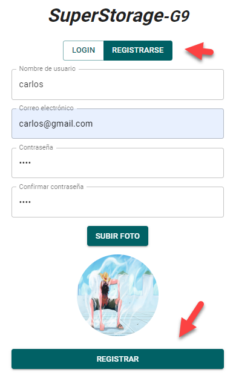
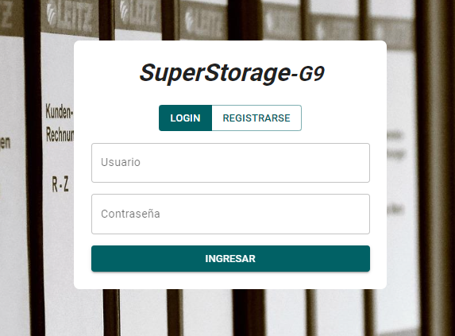
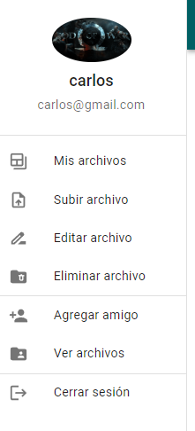
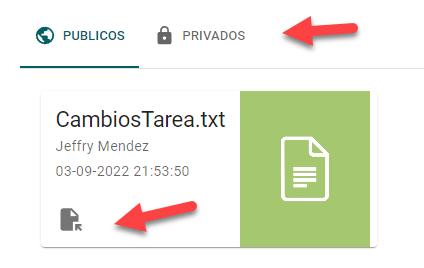
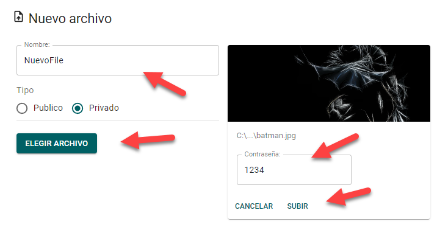
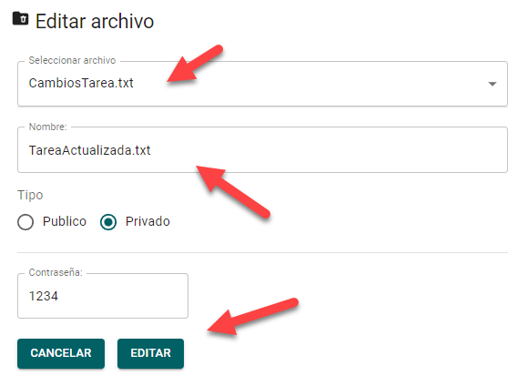
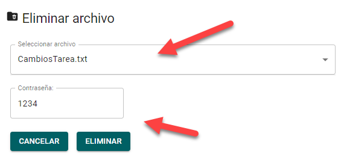
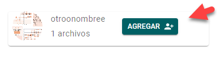
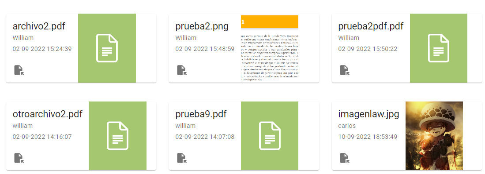

# Manual de usuario

## Objetivos del manual

### General:
- Brindar informacion clara sobre como funciona las herramientas que brinda la aplicacion para su correcto uso por parte del usuario.

### Especificos:
- Demostrar como crear un usuario y iniciar sesión con el.
- Mostrar los pasos para añadir, editar y eliminar archivos.
- Indicar como se agregan los amigos y como ver sus archivos publicos.

## Aplicación Super-Storage
Super storage es una aplicacion que utiliza servicios en la nube para brindar un almacenamiento totalmente seguro a los archivos del usuario. Se pueden realizar multiples acciones como agregar, editar y eliminar. Es necesario crear un usuario en la aplicacion para poder utilizar estas herramientas y empezar a llevar sus archivos a la nube.

Los formatos permitidos para los archivos son:
- Imagenes (png, jpeg, jpg)
- Documentos (txt y pdf)

## Funcionamiento
### Crear usuario
Al presionar el boton de registrarse, hay que llenar los datos y subir una foto de perfil.

### Login
Es necesario escribir las credenciales del usuario creado, se puede utilizar el nombre de usuario o el correo electrónico.

### Menu
Muestra todas las opciones de la aplicación, unicamente es de darle click y se dirigira a la función correspondiente

### Mis archivos
Existen los archivos publicos y privados, ambos se listan en sus respectivas pestañas. Para ver el archivo unicamente hay que darle click al icono de abrir y el documento o imagen se abrira en otra pestaña. Cada archivo trae su nombre, el autor y la fecha en la que fue creado.

### Subir archivo
Se debe colocar el nombre, el tipo de archivo si se desea cambiarlo a privado. Al elegir el archivo a subir es necesario escribir la contraseña. Para subir unicamente darle al boton.

### Editar archivo
Al editar el archivo se pueden cambiar dos cosas: el nombre y su tipo de visibilidad. Se tiene que seleccionar el archivo a cambiar y de igual manera se tiene que escribir la contraseña para validar la operación.

### Eliminar archivo
Para llevar a cabo la operación es necesario seleccionar el archivo y escribir la contraseña.

### Agregar amigo
En este apartado se mostraran las personas disponibles para que se puedan agregar como amigos, unicamente hay que darle al boton para agregar.

### Ver archivos
Si ya agregaron a los amigos, en este apartado se mostraran los archivos que ellos tengan publicos. Se pueden abrir al darle al icono.

