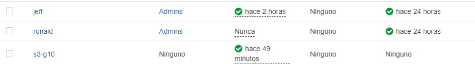
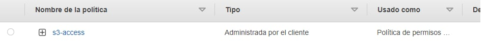
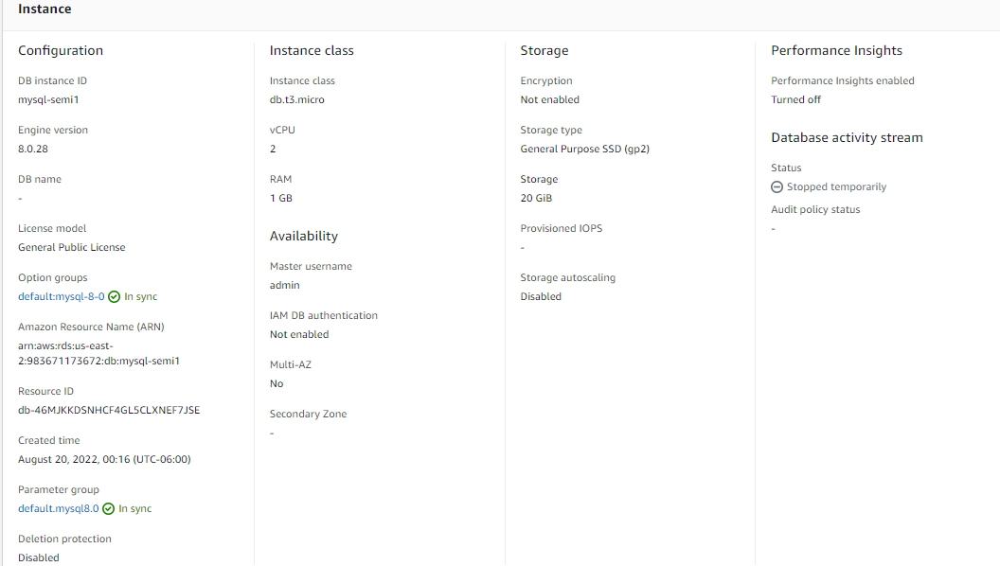
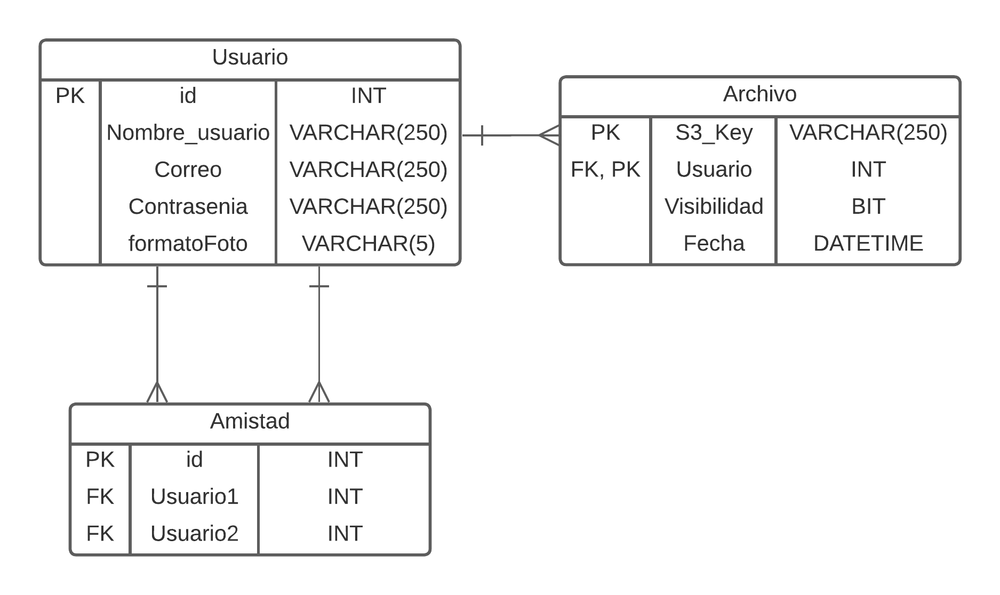
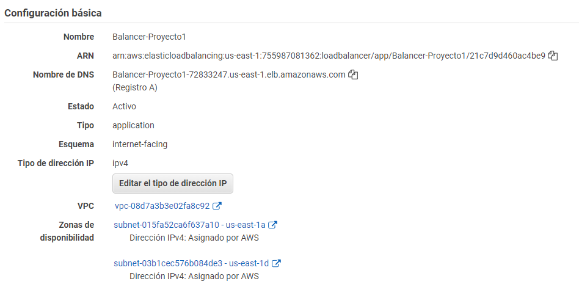
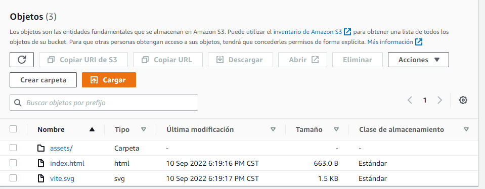
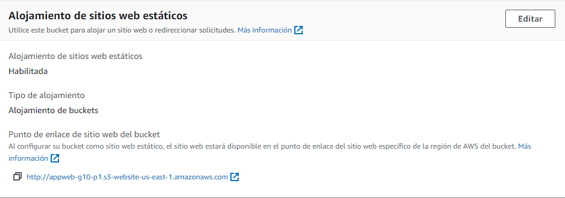
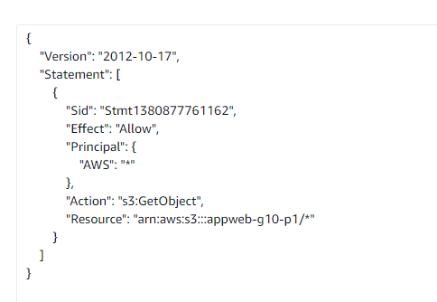

 # Manual Tecnico

## Objetivos del manual

### General: 
- Brindar un mayor entendimiento de como se creo la aplicacion de Super Storage utilizando tecnologias inovadoras  de forma rapida segura y fácil.

### Especificos:
- Dar a conocer como implementar una arquitectura utilizando servicios en la nube, y entender el funcionamiento de estos.
- Especificar como integrar sevicios de AWS.
- Demostrar como aplicar tecnologias de la nube en un entorno real.
- Mostrar los usuarios de IAM que se deben utiilizar con sus respectivas politicas asociadas al desarollar distitnos serivicios en la nube.

## Explicación de arquitectura del proyecto
[colocar contenido]

## Descripcion de los usuarios de IAM utilizado con sus distintos permisos

### Usuarios:

- jeff: Este usario tiene permisos de administrador para poder crear diferentes serivicos dentro de la cuenta principal de AWS.

- ronald: Este usario tiene permisos de administrador para poder crear diferentes serivicos dentro de la cuenta principal de AWS.

- s3-g10: Este es un usuario el cual manipula Buckets de el servicio de S3 iniciando sesion por medio de programacion.

### Politicas :

- s3-acces: Este es la politica que aplica permisos de listado, escritura y actualizacion de Buckets dentro de s3

## Capturas de configuracipon de los servicios
* VM de Node: dentro de la imagen se puede observar las propiedades aplicadas a la VM de Node creada dentro del servicio de ec2.

* Grupos de seguridad VM - Node: en esta imagen se puede observar como a la VM de Node se le permitio entradas por el puerto 9000 y salidas por cualquier puerto.

* Terminus VM - Node: dentro de esta imagen se puede apreciar como se crear un archivo de docker compose dentro de la VM - Node el cual levanta un contendor que corre la aplicacion utilizando la imagen de node.

* RDS - MySQL: en esta imagen se pueden ver las configuraciones aplicadas para la base de datos en MySQL con el servicio de RDS.

* RDS - Modelo entidad relación: en esta imagen se puede ver el modelo entidad relación utilizado para la base de datos.

* Balanceador de carga: Se utilizo el grupo de destinos que fue creado donde se apuntaban a las dos instancias de la api. 

* Pagina web: En S3 se creo un bucket publico, donde se colocaron los archivos resultantes de react build. Se activo el alojamiento de sitio web estatico y se actualizo la politica. 

## Conclusiones
- Las tecnologías utilizadas para el desarrollo de la aplicación ayudaron a que el proceso fuese más rápido, seguro y fácil.
- La arquitectura presentada muestra el funcionamiento integral de diferentes servicios en la nube.
- La integración de los servicios de AWS fue especificada y realizada de manera correcta.
- Las tecnologías de la nube fueron aplicadas a un entorno real y funcional.
- Los usuarios de IAM fueron asociados a las políticas correspondientes para el desarrollo e implementación de distintos servicios en la nube.

