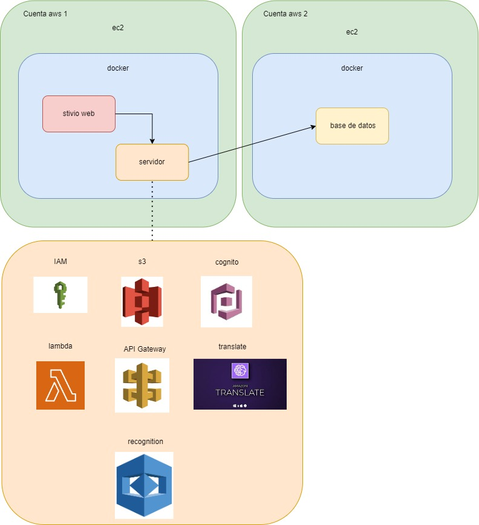
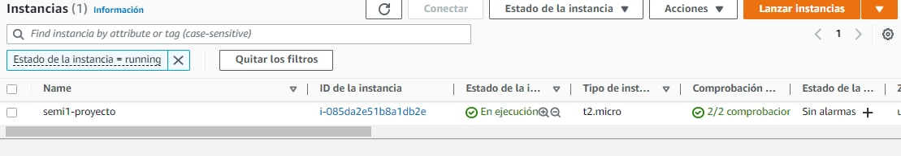
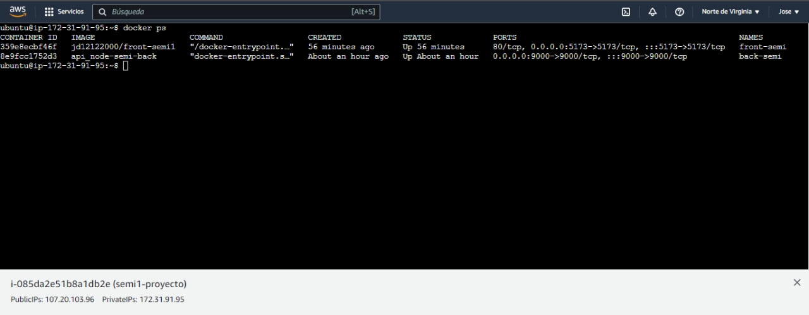
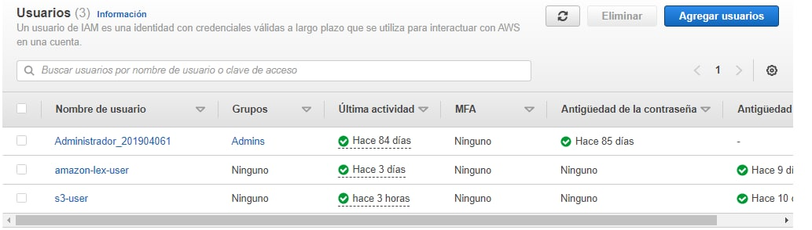
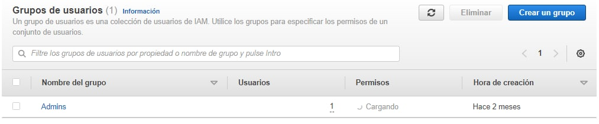
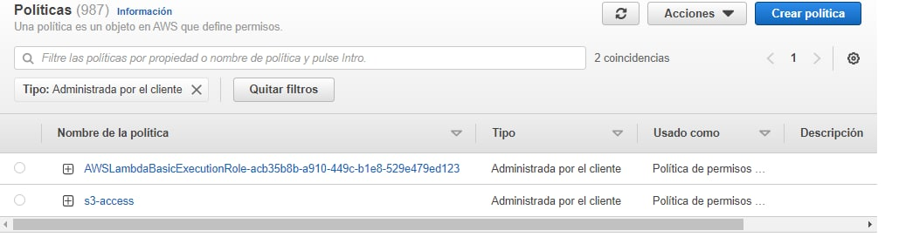

# Documentación

## Arquitectura utilizada:
La arquitectura utilizada fue la siguiente:

Se ha creado un arquitectura en la cual se cuenta con 2 instancias de ec2 las cuales alvergan en su interior contenedores administrados por docker compose. Por un lado esta la instnacia en la cual se aloja el sitio web y el servidor al cual le hace las consultas, por otro lado esta la instancia que alverga la base de datos a la cual el servidor hara peticiones.

Los servios de aws utilizados en el lado del servidor fueron los siguientes:
- IAM: ese servicio se utilizo para crear usuarios, permisos y roles para acceder a los recuersos de las cuentas de aws.
- S3: este servicio se utilizo para almacenar las fotos de los usuarios que utilizan la apliacion para sus perfiles.
- Lamda: este servicio se utilizo en el cracion del bot encargado de ayudar con cuestiones de de la facultad de ingenieria a modo de que cuando un usuario solcite alguna peticion al bot este pueda ser un poco mas interactivo.

Aqui se puede observar la isntancia de ec2 que contiene el servicio web y su servidor:

La cual esta corriendo ambos conetededores:

## Usuarios de IAM con sus permisos y roles:

### Usuarios
Dentro de los usuarios utilizados pdoemos encontrar los siguientes:

- Administrdor_201904061: este usuario fue creado para que el alumno con carnet 201904061 puediera accer uso de los recursos de la cuenta de administrador sin la nesecidad de utilizar el usuario root. Este usuario pertence al grupo de Admis mas descrito adelante.
- amazon-lex-user: este usuario es para poder acceder al servicio creado con amazon lex a travez de programacion por medio del sdk de aws.
- s3-user: este usuario es para poder acceder al servicio creado con s3 a travez de programacion por medio del sdk de aws.

### Grupos

- Admins: este es un grupo para todos aquellos usuarios que neseciten crear y administrar recuersos dentro de la cuenta de aws.

### Politicas

Dentro de las politicas utilizadas se encuentran las siguientes:

- La pimer politica creada en la imagen es para que el usario de amazon lex puedan invocar funciones lamda para brindar de mayor interactividad al bot creado.
- La segunda politica que aparece en la imagen para que los usuarios puedan almacenar sus fotos sin probelmas dentro del servicio de s3.